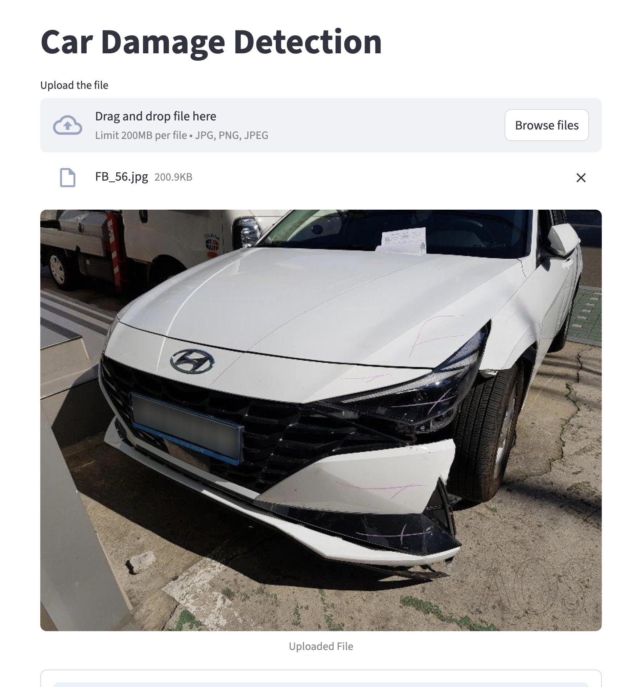
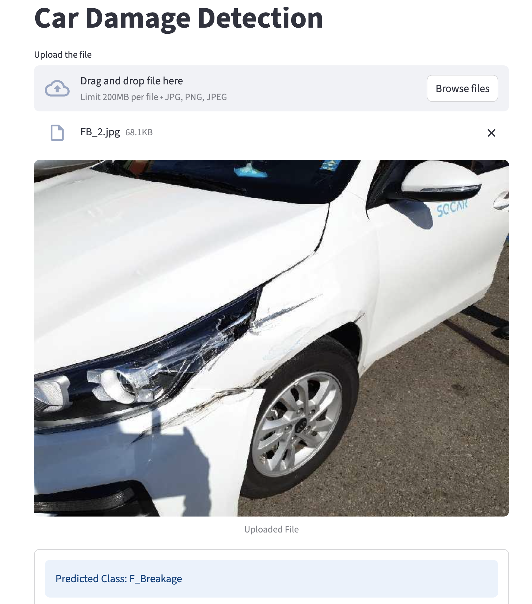
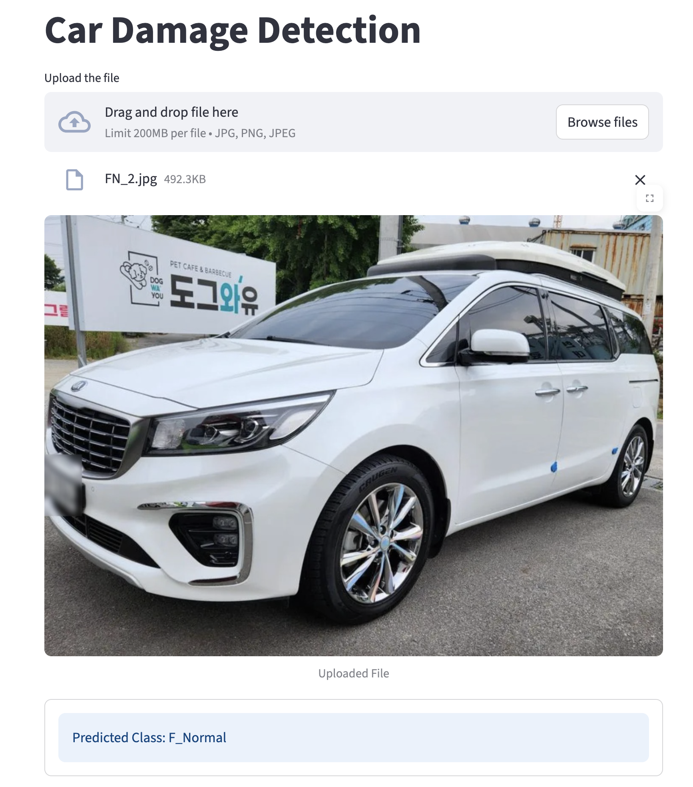
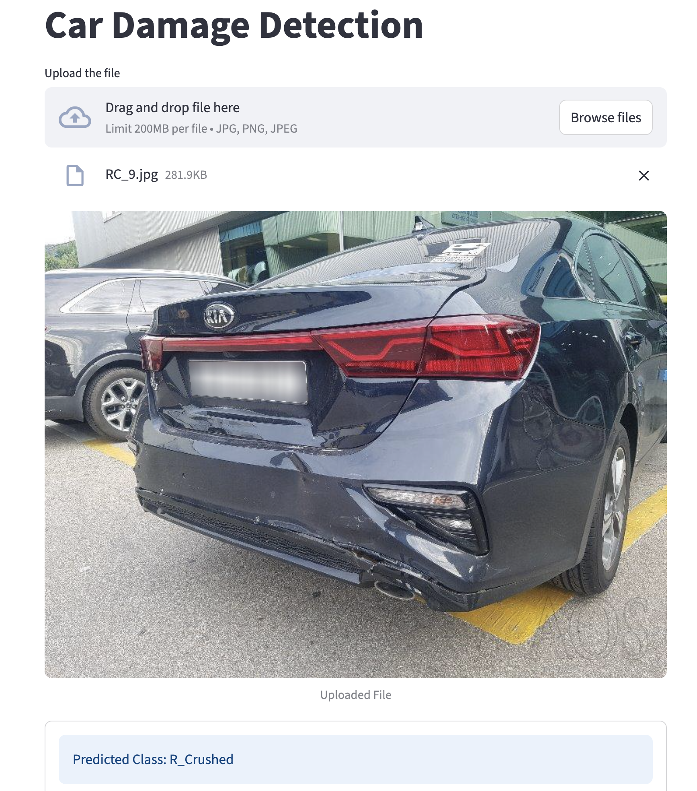

# Car Damage Detection CNN
The objective of this project is to develop a Proof of Concept (POC) for car damage detection that can classify the condition of a car's front and rear into six predefined categories. The solution will be delivered as a trained machine learning model integrated into a Streamlit app



### Backend Server

This code is for FastAPI server that takes car image as an input and predicts if it has a damage or not.
It has a single end point called `predict` which takes input file and returns a response in this format,
```commandline
{
    "prediction": "Rear Breakage"
}
```

### Model Details
1. Used Final Model as ResNet50 for transfer learning
2. Model was trained on around 1700 images (60% Training, 20% Validation and 20% Test) with 6 target classes
   1. Front Normal
   1. Front Crushed
   1. Front Breakage
   1. Rear Normal
   1. Rear Crushed
   1. Rear Breakage

3. Tried 3 Different model
   1. Base Convolutional Neural Network (CNN) | Test Accuracy: 55.00%
   1. CNN with Regularization | Test Accuracy: 43%
   1. Transfer Learning with EfficientNet | Test Accuracy: 69%
   1. Transfer Learning with ResNet | Test Accuracy: 77%
   1. Transfer Learning with ResNet with Hyperparameter Tuning | Test Accuracy: 75%

9. The accuracy on the test set was around 75% using Transfer Learning with ResNet with Hyperparameter Tuning which can be increased with more data and epochs. I have used only 10 epochs and 3 epoch and 20 Trials for Hyperparameter due to Hardware and Time constraint. You can try more epochs for better accuracy.


### Some Result of Predictions 


**Front Breakage**



**Front Normal**




**Rear Crused**



### Set Up

1. To get started, first install the dependencies using:
    ```commandline
     pip install -r requirements.txt
    ```
   
2. Run the fast api server:
   ```commandline
   fastapi dev server.py
